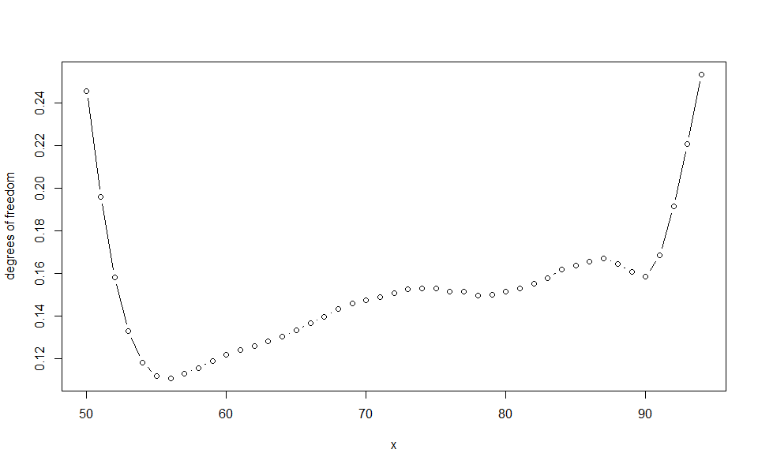
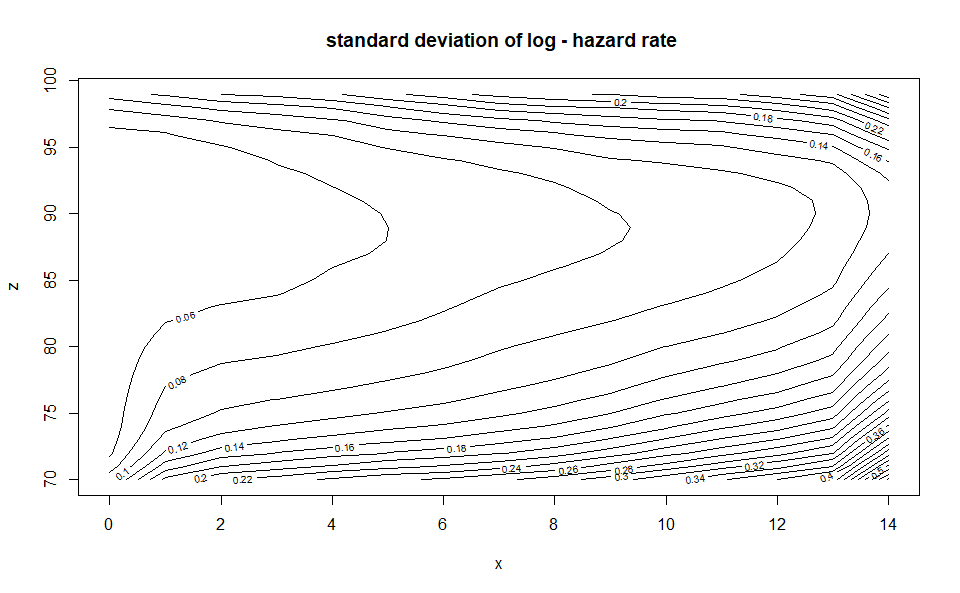

<!-- README.md is generated from README.Rmd. Please edit that file -->

# Revisiting Whittaker-Henderson Smoothing

<!-- badges: start -->

<!-- badges: end -->

## What is Whittaker-Henderson smoothing ?

Whittaker-Henderson (WH) smoothing is a gradation method aimed at
correcting the effect of sampling fluctuations on an observation vector.
It is applied to evenly-spaced discrete observations. Initially proposed
by Whittaker (1922) for constructing mortality tables and further
developed by the works of Henderson (1924), it remains one of the most
popular methods among actuaries for constructing experience tables in
life insurance. Extending to two-dimensional tables, it can be used for
studying various risks, including but not limited to: mortality,
disability, long-term care, lapse, mortgage default, and unemployment.

## How to use the package?

The `WH` package may easily be installed from CRAN by running the code
`install.packages("WH")` in the R Console.

It features a unique main function `WH`. Two arguments are mandatory for
this function:

-   The vector (or matrix in the two-dimension case) `d` corresponding
    to the number of observed events of interest by age (or by age and
    duration in the two-dimension case). `d` should have named elements
    (or rows and columns) for the model results to be extrapolated.

-   The vector (or matrix in the two-dimension case) `ec` corresponding
    to the portfolio central exposure by age (or by age and duration in
    the two-dimension case) whose dimensions should match those of `d`.
    The contribution of each individual to the portfolio central
    exposure corresponds to the time the individual was actually
    observed with corresponding age (and duration in the two-dimension
    case). It always ranges from 0 to 1 and is affected by individuals
    leaving the portfolio, no matter the cause, as well as censoring and
    truncating phenomena.

Additional arguments may be supplied, whose description is given in the
documentation of the functions.

The package also embed two fictive agregated datasets to illustrate how
to use it:

-   `portfolio_mortality` contains the agregated number of deaths and
    associated central exposure by age for an annuity portfolio.

-   `portfolio_LTC` contains the agregated number of deaths and
    associated central exposure by age and duration (in years) since the
    onset of LTC for the annuitant database of a long-term care
    portfolio.

<!-- -->

    # One-dimensional case
    WH_1d_fit <- WH(portfolio_mort$d, portfolio_mort$ec)
    Outer procedure completed in 14 iterations, smoothing parameters: 9327, final LAML: 32.1

    # Two-dimensional case
    WH_2d_fit <- WH(portfolio_LTC$d, portfolio_LTC$ec)
    Outer procedure completed in 63 iterations, smoothing parameters: 1211.41,    1.09, final LAML: 276

Function `WH` outputs objects of class `"WH_1d"` and `"WH_2d"` to which
additional functions (including generic S3 methods) may be applied:

-   The `print` function provides a glimpse of the fitted results

<!-- -->

    WH_1d_fit
    An object fitted using the WH function
    Initial data contains 45 data points:
      Observation positions:  50  to  94 
    Smoothing parameter selected: 9327 
    Associated degrees of freedom: 6.8 
    WH_2d_fit
    An object fitted using the WH function
    Initial data contains 450 data points:
      First dimension:  70  to  99 
      Second dimension:  0  to  14 
    Smoothing parameters selected: 1211.4    1.1 
    Associated degrees of freedom: 47 

-   The `plot` function generates rough plots of the model fit, the
    associated standard deviation, the model residuals or the associated
    degrees of freedom. See the `plot.WH_1d` and `plot.WH_2d` functions
    help for more details.

<!-- -->

    plot(WH_1d_fit)

    plot(WH_1d_fit, "res")

    plot(WH_1d_fit, "edf")

    plot(WH_2d_fit)

    plot(WH_2d_fit, "std_y_hat")

-   The `predict` function generates an extrapolation of the model. It
    requires a `newdata` argument, a named list with one or two elements
    corresponding to the positions of the new observations. In the
    two-dimension case constraints are used so that the predicted values
    matches the fitted values for the initial observations (see
    Carballo, Durban, and Lee 2021 to understand why this is required).

<!-- -->

    WH_1d_fit |> predict(newdata = 18:99) |> plot()

    WH_2d_fit |> predict(newdata = list(age = 50:99, duration = 0:19)) |> plot()

-   The `vcov` may be used to retrieve the variance-covariance matrix of
    the model if necessary.

-   Finally the `output_to_df` function converts an `"WH_1d"` or
    `"WH_2d"` object into a `data.frame`. Information about the fit is
    discarded in the process. This function may be useful to produce
    better visualizations from the data, for example using the ggplot2
    package.

<!-- -->

    WH_1d_df <- WH_1d_fit |> output_to_df()
    WH_2d_df <- WH_2d_fit |> output_to_df()

## Further WH smoothing theory

See the package vignette or the upcoming paper available
[here](https://hal.science/hal-04124043)

## References

Carballo, Alba, Maria Durban, and Dae-Jin Lee. 2021. “Out-of-Sample
Prediction in Multidimensional p-Spline Models.” *Mathematics* 9 (15):
1761.

Henderson, Robert. 1924. “A New Method of Graduation.” *Transactions of
the Actuarial Society of America* 25: 29–40.

Whittaker, Edmund T. 1922. “On a New Method of Graduation.” *Proceedings
of the Edinburgh Mathematical Society* 41: 63–75.
