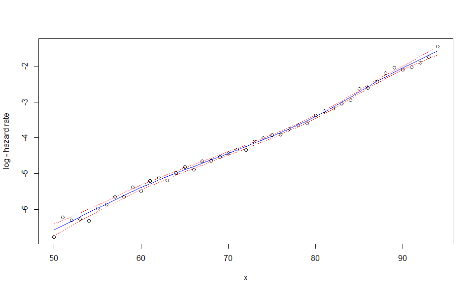
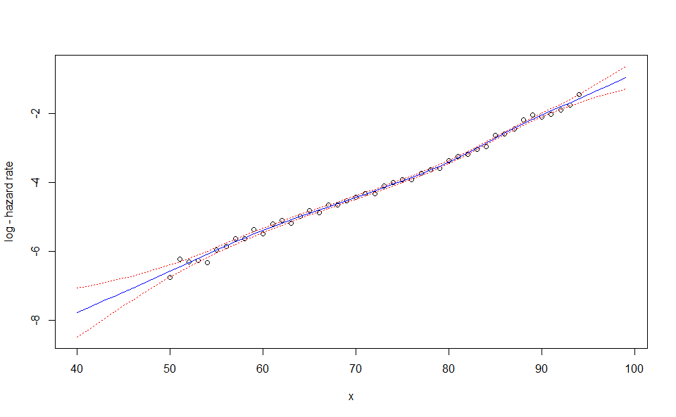
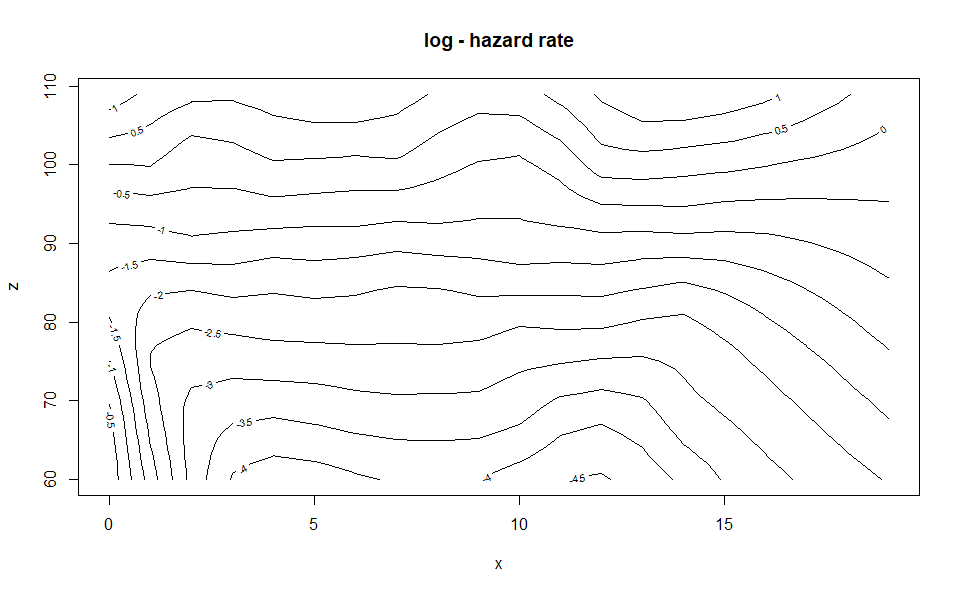

<!-- README.md is generated from README.Rmd. Please edit that file -->

# A Modern Take on Whittaker-Henderson Smoothing

<!-- badges: start -->

[](https://github.com/GuillaumeBiessy/WH/actions/workflows/R-CMD-check.yaml)
<!-- badges: end -->

## What is Whittaker-Henderson smoothing ?

### Origin

The Whittaker-Henderson (WH) smoothing is a graduation method which
attenuates the impact of sample fluctuations. Initially introduced by
Whittaker (1922) for the construction of mortality tables and improved
by the work of Henderson (1924), it remains to date one of the most
popular smoothing method among actuaries working on the modelling of
person insurance risks such as death, disability, long-term care and
unemployement. Whittaker-Henderson smoothing generalizes to
two-dimension smoothing but requires in all cases that the observation
be equally spaced on each dimension.

### The one-dimension case

Let

be an observation vector and

a vector of positive weights, both of size
.
The estimator associated with WH smoothing is:

 + R_{\lambda,q}(\theta)\}")

where:

-  = \underset{i = 1}{\overset{n}{\sum}} w_i(y_i - \theta_i)^2")
  is a fidelity criterion and

-  = \lambda \underset{i = 1}{\overset{n - q}{\sum}} (\Delta^q\theta)_i^2")
  a regularity criterion


represents in the above expression the difference operator of order

such that for all
![i\in\[1,n - q\]](https://latex.codecogs.com/png.image?%5Cdpi%7B110%7D&space;%5Cbg_white&space;i%5Cin%5B1%2Cn%20-%20q%5D "i\in[1,n - q]"):

_i = \underset{k = 0}{\overset{q}{\sum}} \begin{pmatrix}q \\ k\end{pmatrix} (- 1)^{q - k} \theta_{i + k}.")

Let us define
")
the diagonal matrix of weights and

the matrix of differences of order
,
of dimensions
"),
such that
_i = (\Delta^q\theta)_i").
Actually, only differences of order

ar of practical interest. The associated difference matrices are
represented below:


The fidelity and regularity criteria may be rewritten using matrix
notations:

 &= \underset{i = 1}{\overset{n}{\sum}} w_i(y_i - \theta_i)^2 = \Vert\sqrt{W}(y - \theta)\Vert^2 = (y - \theta)^TW(y - \theta) \\
R(\theta,\lambda,q) &= \lambda \underset{i = 1}{\overset{n - q}{\sum}} (\Delta^q\theta)_i^2 = \lambda\Vert D_{n,q}\theta\Vert^2 = \lambda\theta^TD_{n,q}^TD_{n,q}\theta
\end{aligned}")

and the associated estimator becomes:

^TW(y - \theta) + \theta^TP_\lambda\theta\right\rbrace")

by noting in the one-dimension case
.

### The two-dimension case

In the two-dimension case, we start from an observation matrix

and an associated matrix

of positive weights, both of dimensions
.

The estimator associated with Whittaker-Henderson smoothing in this case
reads:

 + R_{\lambda,q}(\Theta)\}")

where:

![\begin{aligned}
F(Y,\Omega, \Theta) &= \underset{i = 1}{\overset{n_x}{\sum}}\underset{j = 1}{\overset{n_z}{\sum}} \Omega\_{i,j}(Y\_{i,j} - \Theta\_{i,j})^2\quad \text{is a fidelity criterion} \\\\
R(\Theta,\lambda,q) &= \lambda_x \underset{j = 1}{\overset{n_z}{\sum}}\underset{i = 1}{\overset{n_x - q_x}{\sum}} (\Delta^{q_x}\Theta\_{\bullet,j})\_i^2 + \lambda_z \underset{i = 1}{\overset{n_x}{\sum}}\underset{j = 1}{\overset{n_z - q_z}{\sum}} (\Delta^{q_z}\Theta\_{i,\bullet})\_j^2 \quad \text{is a regularity criterion.}
\end{aligned}](https://latex.codecogs.com/png.image?%5Cdpi%7B110%7D&space;%5Cbg_white&space;%5Cbegin%7Baligned%7D%0AF%28Y%2C%5COmega%2C%20%5CTheta%29%20%26%3D%20%5Cunderset%7Bi%20%3D%201%7D%7B%5Coverset%7Bn_x%7D%7B%5Csum%7D%7D%5Cunderset%7Bj%20%3D%201%7D%7B%5Coverset%7Bn_z%7D%7B%5Csum%7D%7D%20%5COmega_%7Bi%2Cj%7D%28Y_%7Bi%2Cj%7D%20-%20%5CTheta_%7Bi%2Cj%7D%29%5E2%5Cquad%20%5Ctext%7Bis%20a%20fidelity%20criterion%7D%20%5C%5C%0AR%28%5CTheta%2C%5Clambda%2Cq%29%20%26%3D%20%5Clambda_x%20%5Cunderset%7Bj%20%3D%201%7D%7B%5Coverset%7Bn_z%7D%7B%5Csum%7D%7D%5Cunderset%7Bi%20%3D%201%7D%7B%5Coverset%7Bn_x%20-%20q_x%7D%7B%5Csum%7D%7D%20%28%5CDelta%5E%7Bq_x%7D%5CTheta_%7B%5Cbullet%2Cj%7D%29_i%5E2%20%2B%20%5Clambda_z%20%5Cunderset%7Bi%20%3D%201%7D%7B%5Coverset%7Bn_x%7D%7B%5Csum%7D%7D%5Cunderset%7Bj%20%3D%201%7D%7B%5Coverset%7Bn_z%20-%20q_z%7D%7B%5Csum%7D%7D%20%28%5CDelta%5E%7Bq_z%7D%5CTheta_%7Bi%2C%5Cbullet%7D%29_j%5E2%20%5Cquad%20%5Ctext%7Bis%20a%20regularity%20criterion.%7D%0A%5Cend%7Baligned%7D "\begin{aligned}
F(Y,\Omega, \Theta) &= \underset{i = 1}{\overset{n_x}{\sum}}\underset{j = 1}{\overset{n_z}{\sum}} \Omega_{i,j}(Y_{i,j} - \Theta_{i,j})^2\quad \text{is a fidelity criterion} \\
R(\Theta,\lambda,q) &= \lambda_x \underset{j = 1}{\overset{n_z}{\sum}}\underset{i = 1}{\overset{n_x - q_x}{\sum}} (\Delta^{q_x}\Theta_{\bullet,j})_i^2 + \lambda_z \underset{i = 1}{\overset{n_x}{\sum}}\underset{j = 1}{\overset{n_z - q_z}{\sum}} (\Delta^{q_z}\Theta_{i,\bullet})_j^2 \quad \text{is a regularity criterion.}
\end{aligned}")

The latter criterion may be decomposed as the sum of:

- a one-dimension regularity criterion applied to all rows of
  
  and

- a one-dimension regularity criterion applied to all columns of
  .

Once again it is more convenient to adopt matrix notations by defining
"),
"),
")
the vectors obtained by concatenating the columns of
,

and

respectively and by noting
")
and
.

The fidelity and regularity criteria may this be expressed as funuctions
of
,

and
,
using matrix notations:

 &= \underset{i = 1}{\overset{n}{\sum}}w_i(y_i - \theta_i)^2 = (y - \theta)^TW(y - \theta) \\
R(\theta,\lambda,q) &= \theta^{T}(\lambda_x I_{n_z} \otimes D_{n_x,q_x}^{T}D_{n_x,q_x} + \lambda_z D_{n_z,q_z}^{T}D_{n_z,q_z} \otimes I_{n_x}) \theta
\end{aligned}")

which also leads to the equation:

^TW(y - \theta) + \theta^TP_\lambda\theta\right\rbrace")

except in this case:


## Installation

You can install the development version of WH from
[GitHub](https://github.com/) with:

``` r
# install.packages("devtools")
devtools::install_github("GuillaumeBiessy/WH", build_vignettes = TRUE)
```

## How to use the package ?

The `WH` package features two main functions `WH_1d` and `WH_2d`
corresponding to the one-dimension and two-dimension cases respectively.
Two arguments are mandatory for those functions:

- The vector (or matrix in the two-dimension case) `d` corresponding to
  the number of observed events of interest by age (or by age and
  duration in the two-dimension case). `d` should have named elements
  (or rows and columns) for the model results to be extrapolated.

- The vector (or matrix in the two-dimension case) `ec` corresponding to
  the portfolio central exposure by age (or by age and duration in the
  two-dimension case) whose dimensions should match those of `d`. The
  contribution of each individual to the portfolio central exposure
  corresponds to the time the individual was actually observed with
  corresponding age (and duration in the two-dimension cas). It always
  ranges from 0 to 1 and is affected by individuals leaving the
  portfolio, no matter the cause, as well as censoring and truncating
  phenomena.

Additional arguments are described in the documentation of those
functions.

The package also embed two fictive agregated datasets to illustrate how
to use it:

- `portfolio_mortality` contains the agregated number of deaths and
  associated central exposure by age for an annuity portfolio.

- `portfolio_LTC` contains the agregated number of deaths and associated
  central exposure by age and duration (in years) since the onset of LTC
  for the annuitant database of a long-term care portfolio.

``` r
# One-dimension case
keep <- which(portfolio_mort$ec > 0) # observations with no data
d <- portfolio_mort$d[keep]
ec <- portfolio_mort$ec[keep]

WH_1d_fit <- WH_1d(d, ec)
Using outer iteration / Brent method
```

``` r
# Two_dimension case
keep_age <- which(rowSums(portfolio_LTC$ec) > 1e2)
keep_duration <- which(colSums(portfolio_LTC$ec) > 1e2)

d  <- portfolio_LTC$d[keep_age, keep_duration]
ec <- portfolio_LTC$ec[keep_age, keep_duration]

WH_2d_fit <- WH_2d(d, ec)
Using performance iteration / Nelder-Mead method
```

Functions `WH_1d` and `WH_2d` output objects of class `"WH_1d"` and
`"WH_2d"` to which additional functions (including generic S3 methods)
may be applied:

- The `print` function provides a glimpse of the fitted results

``` r
WH_1d_fit
An object fitted using the WH_1D function
Initial data contains 74 data points:
  Observation positions:  19  to  92 
Optimal smoothing parameter selected: 23368 
Associated degrees of freedom: 4.6 
WH_2d_fit
An object fitted using the WH_2D function
Initial data contains 176 data points:
  First  dimension:  74  to  89 
  Second dimension:  0  to  10 
Optimal smoothing parameters selected: 126.2   9.4 
Associated degrees of freedom: 9.2 
```

- The `plot` function generates rough plots of the model fit, the
  associated standard deviation, the model residuals or the associated
  degrees of freedom. See the `plot.WH_1d` and `plot.WH_2d` functions
  help for more details.

``` r
plot(WH_1d_fit)
```



``` r
plot(WH_1d_fit, "res")
```


``` r
plot(WH_1d_fit, "edf")
```


``` r

plot(WH_2d_fit)
```


``` r
plot(WH_2d_fit, "std_y_hat")
```


- The `predict` function generates an extrapolation of the model. It
  requires a `newdata` argument, a named list with one or two elements
  corresponding to the positions of the new observations. In the
  two-dimension case constraints are used so that the predicted values
  matches the fitted values for the initial observations (see Carballo,
  Durbán, and Lee 2021 to understand why this is required).

``` r
WH_1d_fit |> predict(newdata = 18:99) |> plot()
```



``` r
WH_2d_fit |> predict(newdata = list(age = 50:99,
                                    duration = 0:19)) |> plot()
```



- Finally the `output_to_df` converts an `"WH_1d"` or `"WH_2d"` object
  into a `data.frame`. Information about the fit is lost in the process.
  This may be useful to produce better visualizations, for example using
  the ggplot2 package.

``` r
WH_1d_df <- WH_1d_fit |> output_to_df()
WH_2d_df <- WH_2d_fit |> output_to_df()
```

## Further WH smoothing theory

### Explicit solution

An explicit solution to the smoothing equation is obtained by computing
the derivate according to

of the minimized quantity in the equation. In the cas

contains enough non-0 weights:

^{- 1}Wy.")

### Role of the penalization

In the smoothing equation,
^{T}W(y - \theta)")
is a fidelity criterion

a regularity criterion. The relative importance of those criterions is
controlled by the smoothing parameter (or parameter vectors in the
two-dimension case)
.

In the one-dimension case, the penalization matrix may be rewritten:

![\theta^{T}P\_\lambda\theta = \begin{cases}\lambda\underset{i = 1}{\overset{n - 1}{\sum}}(\theta\_{i + 1} - \theta_i)^2 & \text{si }q = 1\\\\ \lambda\underset{i = 1}{\overset{n - 2}{\sum}}(\[\theta\_{i + 2} - \theta\_{i + 1}\] - \[\theta\_{i + 1} - \theta_i\])^2 & \text{si }q = 2
\end{cases}](https://latex.codecogs.com/png.image?%5Cdpi%7B110%7D&space;%5Cbg_white&space;%5Ctheta%5E%7BT%7DP_%5Clambda%5Ctheta%20%3D%20%5Cbegin%7Bcases%7D%5Clambda%5Cunderset%7Bi%20%3D%201%7D%7B%5Coverset%7Bn%20-%201%7D%7B%5Csum%7D%7D%28%5Ctheta_%7Bi%20%2B%201%7D%20-%20%5Ctheta_i%29%5E2%20%26%20%5Ctext%7Bsi%20%7Dq%20%3D%201%5C%5C%20%5Clambda%5Cunderset%7Bi%20%3D%201%7D%7B%5Coverset%7Bn%20-%202%7D%7B%5Csum%7D%7D%28%5B%5Ctheta_%7Bi%20%2B%202%7D%20-%20%5Ctheta_%7Bi%20%2B%201%7D%5D%20-%20%5B%5Ctheta_%7Bi%20%2B%201%7D%20-%20%5Ctheta_i%5D%29%5E2%20%26%20%5Ctext%7Bsi%20%7Dq%20%3D%202%0A%5Cend%7Bcases%7D "\theta^{T}P_\lambda\theta = \begin{cases}\lambda\underset{i = 1}{\overset{n - 1}{\sum}}(\theta_{i + 1} - \theta_i)^2 & \text{si }q = 1\\ \lambda\underset{i = 1}{\overset{n - 2}{\sum}}([\theta_{i + 2} - \theta_{i + 1}] - [\theta_{i + 1} - \theta_i])^2 & \text{si }q = 2
\end{cases}")

It is easily seen that:

- In the case where
  
  then this is equal to 0 only in the case where, for all
  ![i\in\[1,n_x - 1\]](https://latex.codecogs.com/png.image?%5Cdpi%7B110%7D&space;%5Cbg_white&space;i%5Cin%5B1%2Cn_x%20-%201%5D "i\in[1,n_x - 1]"),
  
  or equivalently for all
  ![i\in\[1,n_x\]](https://latex.codecogs.com/png.image?%5Cdpi%7B110%7D&space;%5Cbg_white&space;i%5Cin%5B1%2Cn_x%5D "i\in[1,n_x]"),
  .

- In the case where
  ,
  this is equal to 0 only in the case where, for all
  ![i\in\[1,n_x - 2\]](https://latex.codecogs.com/png.image?%5Cdpi%7B110%7D&space;%5Cbg_white&space;i%5Cin%5B1%2Cn_x%20-%202%5D "i\in[1,n_x - 2]"),
  ,
  or equivalently for all
  ![i\in\[1,n_x\]](https://latex.codecogs.com/png.image?%5Cdpi%7B110%7D&space;%5Cbg_white&space;i%5Cin%5B1%2Cn_x%5D "i\in[1,n_x]"),
  (\theta_2 - \theta_1)").

In the sense of the penalization of order
,
the space of observation vectors that are totally smooth is therefore
the space of polynomial functions of degrees at most
.
Those results carry on to two-dimension smoothing where a totally smooth
observation matrix

corresponds to constant / aligned observations on the rows / columns of
the observation matrix, depending on the values of

and
.

### Confidence / credibility intervals

Let

a matrix such that
.
The smoothing equation may be rearranged:

^TW(y - \theta) + \theta^TP_\lambda\theta = \left\Vert\begin{pmatrix}\sqrt{W}y \\ 0\end{pmatrix} - \begin{pmatrix}\sqrt{W} \\ B\end{pmatrix}\theta\right\Vert^2")

which corresponds to an weighted mean square problem. In particular, if
")
then
")
and the framework of regression may be used. Note that
")
is in this case both the parameter vector and the underlying law WH
smoothing is trying to estimate.

In the cas of 0 weights, the matrix

is not properly defined. By defining

the subvector of stricly positive weights and

the associated observation vector and noting
"),
the previous quantity may be rewritten:


and the problem may now be expressed properly in terms of

and
.
Nevertheless to keep things simple we stick with

and

and consider that

contains infinite values associated with initial 0 weights in
.

The previous explicit solution to the smoothing equation garanties the
normality of
.
In the framework of regression, the law of error propagation yields:

![\text{Var}(\hat{y}) = \text{Var}\[(W + P\_\lambda)^{- 1}Wy\] = (W + P\_\lambda)^{- 1}W\text{Var}(y) W(W + P\_\lambda)^{- 1} = \sigma^2 (W + P\_\lambda)^{- 1}W(W + P\_\lambda)^{- 1}.](https://latex.codecogs.com/png.image?%5Cdpi%7B110%7D&space;%5Cbg_white&space;%5Ctext%7BVar%7D%28%5Chat%7By%7D%29%20%3D%20%5Ctext%7BVar%7D%5B%28W%20%2B%20P_%5Clambda%29%5E%7B-%201%7DWy%5D%20%3D%20%28W%20%2B%20P_%5Clambda%29%5E%7B-%201%7DW%5Ctext%7BVar%7D%28y%29%20W%28W%20%2B%20P_%5Clambda%29%5E%7B-%201%7D%20%3D%20%5Csigma%5E2%20%28W%20%2B%20P_%5Clambda%29%5E%7B-%201%7DW%28W%20%2B%20P_%5Clambda%29%5E%7B-%201%7D. "\text{Var}(\hat{y}) = \text{Var}[(W + P_\lambda)^{- 1}Wy] = (W + P_\lambda)^{- 1}W\text{Var}(y) W(W + P_\lambda)^{- 1} = \sigma^2 (W + P_\lambda)^{- 1}W(W + P_\lambda)^{- 1}.")

Unfortunately
 = (W + P_\lambda)^{- 1}W\mathbb{E}(y) \ne \mathbb{E}(y)")
if
.
The penalization introduces a *smoothing bias* and those results may not
be used to compute a confidence interval for
.

An alternative is to adopt a bayesian interpretation of the smoothing
equation and to interpretate the penalization as an *a priori* of the
form
")
on
,
which boils down to assume that
")
(where

corresponds to the pseudo-inverse of a matrix
).
Bayes formula then yields:

![\begin{aligned}
f(\theta \| y) &\propto f_y(y \| \theta) f\_\theta(\theta) \\\\
&\propto \exp\left(- \frac{1}{2\sigma^2}(y - \theta)^{T}W(y - \theta)\right)\exp\left(-\frac{1}{2\sigma^2}\theta^{T}P\_\lambda\theta\right) \\\\
&\propto \exp\left(- \frac{1}{2\sigma^2}\left\[(y - \theta)^{T}W(y - \theta) +\theta^{T}P\_\lambda\theta\right\]\right)
\end{aligned}](https://latex.codecogs.com/png.image?%5Cdpi%7B110%7D&space;%5Cbg_white&space;%5Cbegin%7Baligned%7D%0Af%28%5Ctheta%20%7C%20y%29%20%26%5Cpropto%20f_y%28y%20%7C%20%5Ctheta%29%20f_%5Ctheta%28%5Ctheta%29%20%5C%5C%0A%26%5Cpropto%20%5Cexp%5Cleft%28-%20%5Cfrac%7B1%7D%7B2%5Csigma%5E2%7D%28y%20-%20%5Ctheta%29%5E%7BT%7DW%28y%20-%20%5Ctheta%29%5Cright%29%5Cexp%5Cleft%28-%5Cfrac%7B1%7D%7B2%5Csigma%5E2%7D%5Ctheta%5E%7BT%7DP_%5Clambda%5Ctheta%5Cright%29%20%5C%5C%0A%26%5Cpropto%20%5Cexp%5Cleft%28-%20%5Cfrac%7B1%7D%7B2%5Csigma%5E2%7D%5Cleft%5B%28y%20-%20%5Ctheta%29%5E%7BT%7DW%28y%20-%20%5Ctheta%29%20%2B%5Ctheta%5E%7BT%7DP_%5Clambda%5Ctheta%5Cright%5D%5Cright%29%0A%5Cend%7Baligned%7D "\begin{aligned}
f(\theta | y) &\propto f_y(y | \theta) f_\theta(\theta) \\
&\propto \exp\left(- \frac{1}{2\sigma^2}(y - \theta)^{T}W(y - \theta)\right)\exp\left(-\frac{1}{2\sigma^2}\theta^{T}P_\lambda\theta\right) \\
&\propto \exp\left(- \frac{1}{2\sigma^2}\left[(y - \theta)^{T}W(y - \theta) +\theta^{T}P_\lambda\theta\right]\right)
\end{aligned}")

The mode of the posterior distribution
![\hat{\theta} = \text{argmax} \[f(\theta \| y)\]](https://latex.codecogs.com/png.image?%5Cdpi%7B110%7D&space;%5Cbg_white&space;%5Chat%7B%5Ctheta%7D%20%3D%20%5Ctext%7Bargmax%7D%20%5Bf%28%5Ctheta%20%7C%20y%29%5D "\hat{\theta} = \text{argmax} [f(\theta | y)]"),
also known as *maximum a posteriori* (MAP) therefore matches the
solution

of the smoothing equation. Furthermore, a Taylor extension of
")
in

allows the posterior distribution to be recognized as
^{- 1})").

An unbiased estimator of

is then given by:

\Vert^2}{n_* - \text{edf}}")

where

corresponds to the number of non 0 weights and
![\text{edf} = \text{tr}(H) = \text{tr}\[(W + P\_\lambda)^{- 1}W\]](https://latex.codecogs.com/png.image?%5Cdpi%7B110%7D&space;%5Cbg_white&space;%5Ctext%7Bedf%7D%20%3D%20%5Ctext%7Btr%7D%28H%29%20%3D%20%5Ctext%7Btr%7D%5B%28W%20%2B%20P_%5Clambda%29%5E%7B-%201%7DW%5D "\text{edf} = \text{tr}(H) = \text{tr}[(W + P_\lambda)^{- 1}W]").

This result allows
\%")
credibility intervals of the form
![\[\hat{y} \pm t\_{n - \text{edf}}(\frac{1 - \alpha}{2})\sqrt{\text{diag}\left\lbrace(W + P\_\lambda)^{- 1}\right\rbrace}\]](https://latex.codecogs.com/png.image?%5Cdpi%7B110%7D&space;%5Cbg_white&space;%5B%5Chat%7By%7D%20%5Cpm%20t_%7Bn%20-%20%5Ctext%7Bedf%7D%7D%28%5Cfrac%7B1%20-%20%5Calpha%7D%7B2%7D%29%5Csqrt%7B%5Ctext%7Bdiag%7D%5Cleft%5Clbrace%28W%20%2B%20P_%5Clambda%29%5E%7B-%201%7D%5Cright%5Crbrace%7D%5D "[\hat{y} \pm t_{n - \text{edf}}(\frac{1 - \alpha}{2})\sqrt{\text{diag}\left\lbrace(W + P_\lambda)^{- 1}\right\rbrace}]")
to be computed where

is the distribution function for the student law of parameter
.
Let us note that the use of student distribution instead of the normal
distribution is linked with the presence of an unknown

parameter.

## What should I use as observations and weights ?

The previous section show that applying WH smoothing to a couple
")
such that
")
where

is the underlying law we want to estimate,

is an overdispersion parameter to be estimated, and
"),
then, using a bayesian interpration, credibility intervals were
available for the posterior distribution of
.
In this section, in the framework of survival analysis models, we
exhibit a candidate for
").

### Survival analysis framework - one-dimension case

Let us consider the observation of

individuals in the cas of a longitudinal study under left-truncating and
right-censoring phenomena. Let us assume a single law must be estimated
(for example a mortality law) and that it depends on a single covariate
named

(for example the age of the insured). This law may be entirely
characterized by providing one of the 3 following quantities:

- The cumulative distribution function
  ")
  or the survival function
   = 1 - F(x)"),

- The associated density function
   = - \frac{\text{d}}{\text{d}x}S(x)"),

- The hazard rate
   = - \frac{\text{d}}{\text{d}x}\text{ln} S(x)")

Let us assume that the underlying law depends on a parameter vector

that is to be estimated using maximum likelihood. The likelihood
associated with the observation of the individuals is:

![\mathcal{L}(\beta) = \underset{i = 1}{\overset{m}{\prod}} \left\[\frac{f(x_i + t_i,\beta)}{S(x_i,\beta)}\right\]^{\delta_i}\left\[\frac{S(x_i + t_i,\beta)}{S(x_i,\beta)}\right\]^{1 - \delta_i}](https://latex.codecogs.com/png.image?%5Cdpi%7B110%7D&space;%5Cbg_white&space;%5Cmathcal%7BL%7D%28%5Cbeta%29%20%3D%20%5Cunderset%7Bi%20%3D%201%7D%7B%5Coverset%7Bm%7D%7B%5Cprod%7D%7D%20%5Cleft%5B%5Cfrac%7Bf%28x_i%20%2B%20t_i%2C%5Cbeta%29%7D%7BS%28x_i%2C%5Cbeta%29%7D%5Cright%5D%5E%7B%5Cdelta_i%7D%5Cleft%5B%5Cfrac%7BS%28x_i%20%2B%20t_i%2C%5Cbeta%29%7D%7BS%28x_i%2C%5Cbeta%29%7D%5Cright%5D%5E%7B1%20-%20%5Cdelta_i%7D "\mathcal{L}(\beta) = \underset{i = 1}{\overset{m}{\prod}} \left[\frac{f(x_i + t_i,\beta)}{S(x_i,\beta)}\right]^{\delta_i}\left[\frac{S(x_i + t_i,\beta)}{S(x_i,\beta)}\right]^{1 - \delta_i}")

where for each

represents the age at the start of the observation,

is the observation duration and

is 1 if the event of interest (for example death) has been observed and
0 otherwise. Those 3 elements should be computed by taking into account
the date of subscribing and a possible termination date (for example
beauce of policy lapse) for each individual, possible presence of a
waiting period and exclusion of specific periods of time because of
incomplete data or medical underwriting effects. The observation period
may therefore be shorter than the actual period of presence of the
individuals in the portfolio.

Maximization of the previous likelihood may be rewritten by taking the
logarithm and using the relations:

 & = \exp\left(\underset{u = 0}{\overset{x}{\int}}\mu(u)\text{d}u\right) & f(x) & = \mu(x)S(x)
\end{aligned}")

which yields, after a few simplifications:

![\ell(\beta) = \underset{i = 1}{\overset{m}{\sum}} \left\[\delta_i \ln\mu(x_i + t_i,\beta) - \underset{u = 0}{\overset{t_i}{\int}}\mu(x_i + u,\beta)\text{d}u\right\]](https://latex.codecogs.com/png.image?%5Cdpi%7B110%7D&space;%5Cbg_white&space;%5Cell%28%5Cbeta%29%20%3D%20%5Cunderset%7Bi%20%3D%201%7D%7B%5Coverset%7Bm%7D%7B%5Csum%7D%7D%20%5Cleft%5B%5Cdelta_i%20%5Cln%5Cmu%28x_i%20%2B%20t_i%2C%5Cbeta%29%20-%20%5Cunderset%7Bu%20%3D%200%7D%7B%5Coverset%7Bt_i%7D%7B%5Cint%7D%7D%5Cmu%28x_i%20%2B%20u%2C%5Cbeta%29%5Ctext%7Bd%7Du%5Cright%5D "\ell(\beta) = \underset{i = 1}{\overset{m}{\sum}} \left[\delta_i \ln\mu(x_i + t_i,\beta) - \underset{u = 0}{\overset{t_i}{\int}}\mu(x_i + u,\beta)\text{d}u\right]")

Let us assume that the hazard rate is a piecewise constant function on
one-year interval between integer ages or more formally:
 = \mu(x)")
for all

and
.

Let us further note that if

is the index function, then for all
,
 = 1")
by noting
")
and
").
The previous likelihood therefore becomes:

![\ell(\beta) = \underset{i = 1}{\overset{m}{\sum}} \left\[\underset{x = x\_{\min}}{\overset{x\_{\max}}{\sum}} \delta_i\mathbf{1}(x \le x_i + t_i \< x + 1)  \ln\mu(x_i + t_i,\beta) - \underset{u = 0}{\overset{t_i}{\int}}\underset{x = x\_{\min}}{\overset{x\_{\max}}{\sum}} \mathbf{1}(x \le x_i + u \< x + 1)\mu(x_i + u,\beta)\text{d}u\right\]](https://latex.codecogs.com/png.image?%5Cdpi%7B110%7D&space;%5Cbg_white&space;%5Cell%28%5Cbeta%29%20%3D%20%5Cunderset%7Bi%20%3D%201%7D%7B%5Coverset%7Bm%7D%7B%5Csum%7D%7D%20%5Cleft%5B%5Cunderset%7Bx%20%3D%20x_%7B%5Cmin%7D%7D%7B%5Coverset%7Bx_%7B%5Cmax%7D%7D%7B%5Csum%7D%7D%20%5Cdelta_i%5Cmathbf%7B1%7D%28x%20%5Cle%20x_i%20%2B%20t_i%20%3C%20x%20%2B%201%29%20%20%5Cln%5Cmu%28x_i%20%2B%20t_i%2C%5Cbeta%29%20-%20%5Cunderset%7Bu%20%3D%200%7D%7B%5Coverset%7Bt_i%7D%7B%5Cint%7D%7D%5Cunderset%7Bx%20%3D%20x_%7B%5Cmin%7D%7D%7B%5Coverset%7Bx_%7B%5Cmax%7D%7D%7B%5Csum%7D%7D%20%5Cmathbf%7B1%7D%28x%20%5Cle%20x_i%20%2B%20u%20%3C%20x%20%2B%201%29%5Cmu%28x_i%20%2B%20u%2C%5Cbeta%29%5Ctext%7Bd%7Du%5Cright%5D "\ell(\beta) = \underset{i = 1}{\overset{m}{\sum}} \left[\underset{x = x_{\min}}{\overset{x_{\max}}{\sum}} \delta_i\mathbf{1}(x \le x_i + t_i < x + 1)  \ln\mu(x_i + t_i,\beta) - \underset{u = 0}{\overset{t_i}{\int}}\underset{x = x_{\min}}{\overset{x_{\max}}{\sum}} \mathbf{1}(x \le x_i + u < x + 1)\mu(x_i + u,\beta)\text{d}u\right]")

The piecewise constant assumption yields
 \ln\mu(x_i + t_i,\beta) = \mathbf{1}(x \le x_i + t_i < x + 1) \ln\mu(x,\beta)")
and
\mu(x_i + u,\beta) = \mathbf{1}(x \le x_i + u < x + 1) \ln\mu(x,\beta)").
The two sums may then be interverted, giving:

![\begin{aligned}
\ell(\beta) &= \underset{x = x\_{\min}}{\overset{x\_{\max}}{\sum}} \left\[\ln\mu(x,\beta) d(x) - \mu(x,\beta) e_c(x)\right\] \quad \text{where} \\\\
d(x) & = \underset{i = 1}{\overset{m}{\sum}} \delta_i \mathbf{1}(x \le x_i + t_i \< x + 1)  \quad \text{and} \\\\
e_c(x) & = \underset{i = 1}{\overset{m}{\sum}}\underset{u = 0}{\overset{t_i}{\int}}\mathbf{1}(x \le x_i + u \< x + 1)\text{d}u = \underset{i = 1}{\overset{m}{\sum}} \left\[\min(t_i, x - x_i + 1) - \max(0, x - x_i)\right\]^+
\end{aligned}](https://latex.codecogs.com/png.image?%5Cdpi%7B110%7D&space;%5Cbg_white&space;%5Cbegin%7Baligned%7D%0A%5Cell%28%5Cbeta%29%20%26%3D%20%5Cunderset%7Bx%20%3D%20x_%7B%5Cmin%7D%7D%7B%5Coverset%7Bx_%7B%5Cmax%7D%7D%7B%5Csum%7D%7D%20%5Cleft%5B%5Cln%5Cmu%28x%2C%5Cbeta%29%20d%28x%29%20-%20%5Cmu%28x%2C%5Cbeta%29%20e_c%28x%29%5Cright%5D%20%5Cquad%20%5Ctext%7Bwhere%7D%20%5C%5C%0Ad%28x%29%20%26%20%3D%20%5Cunderset%7Bi%20%3D%201%7D%7B%5Coverset%7Bm%7D%7B%5Csum%7D%7D%20%5Cdelta_i%20%5Cmathbf%7B1%7D%28x%20%5Cle%20x_i%20%2B%20t_i%20%3C%20x%20%2B%201%29%20%20%5Cquad%20%5Ctext%7Band%7D%20%5C%5C%0Ae_c%28x%29%20%26%20%3D%20%5Cunderset%7Bi%20%3D%201%7D%7B%5Coverset%7Bm%7D%7B%5Csum%7D%7D%5Cunderset%7Bu%20%3D%200%7D%7B%5Coverset%7Bt_i%7D%7B%5Cint%7D%7D%5Cmathbf%7B1%7D%28x%20%5Cle%20x_i%20%2B%20u%20%3C%20x%20%2B%201%29%5Ctext%7Bd%7Du%20%3D%20%5Cunderset%7Bi%20%3D%201%7D%7B%5Coverset%7Bm%7D%7B%5Csum%7D%7D%20%5Cleft%5B%5Cmin%28t_i%2C%20x%20-%20x_i%20%2B%201%29%20-%20%5Cmax%280%2C%20x%20-%20x_i%29%5Cright%5D%5E%2B%0A%5Cend%7Baligned%7D "\begin{aligned}
\ell(\beta) &= \underset{x = x_{\min}}{\overset{x_{\max}}{\sum}} \left[\ln\mu(x,\beta) d(x) - \mu(x,\beta) e_c(x)\right] \quad \text{where} \\
d(x) & = \underset{i = 1}{\overset{m}{\sum}} \delta_i \mathbf{1}(x \le x_i + t_i < x + 1)  \quad \text{and} \\
e_c(x) & = \underset{i = 1}{\overset{m}{\sum}}\underset{u = 0}{\overset{t_i}{\int}}\mathbf{1}(x \le x_i + u < x + 1)\text{d}u = \underset{i = 1}{\overset{m}{\sum}} \left[\min(t_i, x - x_i + 1) - \max(0, x - x_i)\right]^+
\end{aligned}")

where
")
and
")
corresponds respectively to the number of observed deaths between age

and

and to the sum of the observation duration between those dates, by
noting
").

### Extension to the two-dimension case

The extension of the previous approach to the two-dimension case only
requires minor adjustements to the previous proposition. Let us note
")
and
").
The piecewise constant assumption needs to be extended to each of the
two dimensions. Formally we now assume that
 = \mu(x, z)")
for all

and
.
The sums on

are replaced by double sums on the values of both

and

and the likelihood becomes:

![\begin{aligned}
\ell(\beta) &= \underset{x = x\_{\min}}{\overset{x\_{\max}}{\sum}} \underset{z = z\_{\min}}{\overset{z\_{\max}}{\sum}}\left\[\ln\mu(x,z,\beta) d(x,z) - \mu(x,z,\beta) e_c(x,z)\right\] \quad \text{where} \\\\
d(x,z) & = \underset{i = 1}{\overset{m}{\sum}} \delta_i \mathbf{1}(x \le x_i + t_i \< x + 1) \mathbf{1}(z \le z_i + t_i \< z + 1)  \quad \text{and}\\\\
e_c(x,z) & = \underset{i = 1}{\overset{m}{\sum}}\underset{u = 0}{\overset{t_i}{\int}}\mathbf{1}(x \le x_i + u \< x + 1)\mathbf{1}(z \le z_i + u \< z + 1)\text{d}u \\\\
& = \underset{i = 1}{\overset{m}{\sum}} \left\[\min(t_i, x + 1 - x_i, z + 1 - z_i) - \max(0, x - x_i, z - z_i)\right\]^+.
\end{aligned}](https://latex.codecogs.com/png.image?%5Cdpi%7B110%7D&space;%5Cbg_white&space;%5Cbegin%7Baligned%7D%0A%5Cell%28%5Cbeta%29%20%26%3D%20%5Cunderset%7Bx%20%3D%20x_%7B%5Cmin%7D%7D%7B%5Coverset%7Bx_%7B%5Cmax%7D%7D%7B%5Csum%7D%7D%20%5Cunderset%7Bz%20%3D%20z_%7B%5Cmin%7D%7D%7B%5Coverset%7Bz_%7B%5Cmax%7D%7D%7B%5Csum%7D%7D%5Cleft%5B%5Cln%5Cmu%28x%2Cz%2C%5Cbeta%29%20d%28x%2Cz%29%20-%20%5Cmu%28x%2Cz%2C%5Cbeta%29%20e_c%28x%2Cz%29%5Cright%5D%20%5Cquad%20%5Ctext%7Bwhere%7D%20%5C%5C%0Ad%28x%2Cz%29%20%26%20%3D%20%5Cunderset%7Bi%20%3D%201%7D%7B%5Coverset%7Bm%7D%7B%5Csum%7D%7D%20%5Cdelta_i%20%5Cmathbf%7B1%7D%28x%20%5Cle%20x_i%20%2B%20t_i%20%3C%20x%20%2B%201%29%20%5Cmathbf%7B1%7D%28z%20%5Cle%20z_i%20%2B%20t_i%20%3C%20z%20%2B%201%29%20%20%5Cquad%20%5Ctext%7Band%7D%5C%5C%0Ae_c%28x%2Cz%29%20%26%20%3D%20%5Cunderset%7Bi%20%3D%201%7D%7B%5Coverset%7Bm%7D%7B%5Csum%7D%7D%5Cunderset%7Bu%20%3D%200%7D%7B%5Coverset%7Bt_i%7D%7B%5Cint%7D%7D%5Cmathbf%7B1%7D%28x%20%5Cle%20x_i%20%2B%20u%20%3C%20x%20%2B%201%29%5Cmathbf%7B1%7D%28z%20%5Cle%20z_i%20%2B%20u%20%3C%20z%20%2B%201%29%5Ctext%7Bd%7Du%20%5C%5C%0A%26%20%3D%20%5Cunderset%7Bi%20%3D%201%7D%7B%5Coverset%7Bm%7D%7B%5Csum%7D%7D%20%5Cleft%5B%5Cmin%28t_i%2C%20x%20%2B%201%20-%20x_i%2C%20z%20%2B%201%20-%20z_i%29%20-%20%5Cmax%280%2C%20x%20-%20x_i%2C%20z%20-%20z_i%29%5Cright%5D%5E%2B.%0A%5Cend%7Baligned%7D "\begin{aligned}
\ell(\beta) &= \underset{x = x_{\min}}{\overset{x_{\max}}{\sum}} \underset{z = z_{\min}}{\overset{z_{\max}}{\sum}}\left[\ln\mu(x,z,\beta) d(x,z) - \mu(x,z,\beta) e_c(x,z)\right] \quad \text{where} \\
d(x,z) & = \underset{i = 1}{\overset{m}{\sum}} \delta_i \mathbf{1}(x \le x_i + t_i < x + 1) \mathbf{1}(z \le z_i + t_i < z + 1)  \quad \text{and}\\
e_c(x,z) & = \underset{i = 1}{\overset{m}{\sum}}\underset{u = 0}{\overset{t_i}{\int}}\mathbf{1}(x \le x_i + u < x + 1)\mathbf{1}(z \le z_i + u < z + 1)\text{d}u \\
& = \underset{i = 1}{\overset{m}{\sum}} \left[\min(t_i, x + 1 - x_i, z + 1 - z_i) - \max(0, x - x_i, z - z_i)\right]^+.
\end{aligned}")

### Likelihood equations

The log-likelihood in the one-dimension or two-dimension cases may be
expressed on the common vectorial form
 = \ln\mu(\beta)^{T}d - \mu(\beta)^{T}e_c")
where

and

corresponds respectively to the vector of expected events and associated
central exposure.

In the particular case of log-linear models, the hazard rate may be
defined as
 = X\beta")
with

a matrix of dimensions

and full-rank
.
The use of the logarithmic link ensures that
")
is always positive. Derivatives of the log-likelihood function are for
this model:

![\frac{\partial \ell}{\partial \beta} = X^{T}\left\[d - \exp(X\beta) \odot e_c\right\] \quad \text{and} \quad \frac{\partial^2 \ell}{\partial\beta^2} = - X^{T}W\_{\beta}X \quad \text{where} \quad W\_{\beta} = \text{Diag}(\exp(X\beta) \odot e_c).](https://latex.codecogs.com/png.image?%5Cdpi%7B110%7D&space;%5Cbg_white&space;%5Cfrac%7B%5Cpartial%20%5Cell%7D%7B%5Cpartial%20%5Cbeta%7D%20%3D%20X%5E%7BT%7D%5Cleft%5Bd%20-%20%5Cexp%28X%5Cbeta%29%20%5Codot%20e_c%5Cright%5D%20%5Cquad%20%5Ctext%7Band%7D%20%5Cquad%20%5Cfrac%7B%5Cpartial%5E2%20%5Cell%7D%7B%5Cpartial%5Cbeta%5E2%7D%20%3D%20-%20X%5E%7BT%7DW_%7B%5Cbeta%7DX%20%5Cquad%20%5Ctext%7Bwhere%7D%20%5Cquad%20W_%7B%5Cbeta%7D%20%3D%20%5Ctext%7BDiag%7D%28%5Cexp%28X%5Cbeta%29%20%5Codot%20e_c%29. "\frac{\partial \ell}{\partial \beta} = X^{T}\left[d - \exp(X\beta) \odot e_c\right] \quad \text{and} \quad \frac{\partial^2 \ell}{\partial\beta^2} = - X^{T}W_{\beta}X \quad \text{where} \quad W_{\beta} = \text{Diag}(\exp(X\beta) \odot e_c).")

Let us note that those likelihood equations are exactly those that would
have been obtained by treating the central exposure as a deterministic
quantity and by assuming that the number of deaths follows a Poisson GLM
of parameter
\times e_c").
The model above therefore behave as a Poisson GLM (John Ashworth Nelder
and Wedderburn 1972).

### Consequences for WH smoothing

Whittaker-Henderson focuses on the particular case where

and
.
In that case the previous equations yield an explicit solution
 - \ln(e_c)")
and thus
.

Using the asymptotical properties of the maximum likelihood estimator,
we obtain
")
where diagonal elements of

are simply
 = e_c d / e_c = d").

Thus it has been shown that in the survival analysis framework
introduced, asymptotically
 \sim \mathcal{N}(\ln(\mu), W^{- 1})")
where
").
This justify applying WH smoothing to the observation vector
")
with weights
.
The overdispersion parameter is in this cas simply
.
We obtain credibility intervals for the posterior distribution

of the form:
![\[\hat{y} \pm \Phi(\frac{1 - \alpha}{2})\sqrt{\text{diag}\left\lbrace(W + P\_\lambda)^{- 1}\right\rbrace}\]](https://latex.codecogs.com/png.image?%5Cdpi%7B110%7D&space;%5Cbg_white&space;%5B%5Chat%7By%7D%20%5Cpm%20%5CPhi%28%5Cfrac%7B1%20-%20%5Calpha%7D%7B2%7D%29%5Csqrt%7B%5Ctext%7Bdiag%7D%5Cleft%5Clbrace%28W%20%2B%20P_%5Clambda%29%5E%7B-%201%7D%5Cright%5Crbrace%7D%5D "[\hat{y} \pm \Phi(\frac{1 - \alpha}{2})\sqrt{\text{diag}\left\lbrace(W + P_\lambda)^{- 1}\right\rbrace}]").

### Generalization to penalized maximum likelihood

The previous approach relies on the asymptotic properties of the maximum
likelihood estimator. When few data is available, those properties may
not hold. An alternative approach is to apply the penalization from the
WH smoothing directly to the previous likelihood function and thus
maximize the penalizaed likelihood
 = \ell(\beta) - \beta^{T}P_\lambda\beta / 2").
This can be seen as a generalization of WH smoothing to non-gaussian
likelihood. Still assuming a log-linear model is used, derivatives of
the log-likelihood functions become:

![\frac{\partial \ell_P}{\partial \beta} = X^{T}\left\[d - \exp(X\beta) \odot e_c\right\] - P\_\lambda\beta \quad \text{and} \quad \frac{\partial^2 \ell_P}{\partial\beta^2} = - (X^{T}W\_{\beta}X + P\_\lambda) \quad \text{where} \quad W\_{\beta} = \text{Diag}(\exp(X\beta) \odot e_c).](https://latex.codecogs.com/png.image?%5Cdpi%7B110%7D&space;%5Cbg_white&space;%5Cfrac%7B%5Cpartial%20%5Cell_P%7D%7B%5Cpartial%20%5Cbeta%7D%20%3D%20X%5E%7BT%7D%5Cleft%5Bd%20-%20%5Cexp%28X%5Cbeta%29%20%5Codot%20e_c%5Cright%5D%20-%20P_%5Clambda%5Cbeta%20%5Cquad%20%5Ctext%7Band%7D%20%5Cquad%20%5Cfrac%7B%5Cpartial%5E2%20%5Cell_P%7D%7B%5Cpartial%5Cbeta%5E2%7D%20%3D%20-%20%28X%5E%7BT%7DW_%7B%5Cbeta%7DX%20%2B%20P_%5Clambda%29%20%5Cquad%20%5Ctext%7Bwhere%7D%20%5Cquad%20W_%7B%5Cbeta%7D%20%3D%20%5Ctext%7BDiag%7D%28%5Cexp%28X%5Cbeta%29%20%5Codot%20e_c%29. "\frac{\partial \ell_P}{\partial \beta} = X^{T}\left[d - \exp(X\beta) \odot e_c\right] - P_\lambda\beta \quad \text{and} \quad \frac{\partial^2 \ell_P}{\partial\beta^2} = - (X^{T}W_{\beta}X + P_\lambda) \quad \text{where} \quad W_{\beta} = \text{Diag}(\exp(X\beta) \odot e_c).")

Unlike the previously encountered likelihood, those equations does not
have an explicit solution, even when
,
because both

and
")
appear in the equations. Using Newton algorithm, a series of estimators
_{k \ge 0}")
may be built so that it converges to the penalized maximum likelihood
estimator
").

Those estimators are defined by:

![\begin{aligned}
\beta\_{k + 1} &= \beta_k - \left(\left.\frac{\partial^2 \ell_P}{\partial\beta^2}\right\|\_{\beta = \beta_k}\right)^{- 1} \left.\frac{\partial \ell_P}{\partial\beta}\right\|\_{\beta = \beta_k} \\\\ 
&= \beta_k + (X^{T}W_kX + P\_\lambda)^{- 1} \left\[X^{T}\left(d - \exp(X\beta_k) \odot e_c\right) - P\_\lambda \beta_k\right\] \\\\ 
&= \Psi_k X^{T}W_k z_k
\end{aligned}](https://latex.codecogs.com/png.image?%5Cdpi%7B110%7D&space;%5Cbg_white&space;%5Cbegin%7Baligned%7D%0A%5Cbeta_%7Bk%20%2B%201%7D%20%26%3D%20%5Cbeta_k%20-%20%5Cleft%28%5Cleft.%5Cfrac%7B%5Cpartial%5E2%20%5Cell_P%7D%7B%5Cpartial%5Cbeta%5E2%7D%5Cright%7C_%7B%5Cbeta%20%3D%20%5Cbeta_k%7D%5Cright%29%5E%7B-%201%7D%20%5Cleft.%5Cfrac%7B%5Cpartial%20%5Cell_P%7D%7B%5Cpartial%5Cbeta%7D%5Cright%7C_%7B%5Cbeta%20%3D%20%5Cbeta_k%7D%20%5C%5C%20%0A%26%3D%20%5Cbeta_k%20%2B%20%28X%5E%7BT%7DW_kX%20%2B%20P_%5Clambda%29%5E%7B-%201%7D%20%5Cleft%5BX%5E%7BT%7D%5Cleft%28d%20-%20%5Cexp%28X%5Cbeta_k%29%20%5Codot%20e_c%5Cright%29%20-%20P_%5Clambda%20%5Cbeta_k%5Cright%5D%20%5C%5C%20%0A%26%3D%20%5CPsi_k%20X%5E%7BT%7DW_k%20z_k%0A%5Cend%7Baligned%7D "\begin{aligned}
\beta_{k + 1} &= \beta_k - \left(\left.\frac{\partial^2 \ell_P}{\partial\beta^2}\right|_{\beta = \beta_k}\right)^{- 1} \left.\frac{\partial \ell_P}{\partial\beta}\right|_{\beta = \beta_k} \\ 
&= \beta_k + (X^{T}W_kX + P_\lambda)^{- 1} \left[X^{T}\left(d - \exp(X\beta_k) \odot e_c\right) - P_\lambda \beta_k\right] \\ 
&= \Psi_k X^{T}W_k z_k
\end{aligned}")

by noting
,
^{- 1}"),
 \odot e_c)")
and
![z_k = \eta_k + W_k^{- 1}\[d - \exp(\eta_k) \odot e_c\]](https://latex.codecogs.com/png.image?%5Cdpi%7B110%7D&space;%5Cbg_white&space;z_k%20%3D%20%5Ceta_k%20%2B%20W_k%5E%7B-%201%7D%5Bd%20-%20%5Cexp%28%5Ceta_k%29%20%5Codot%20e_c%5D "z_k = \eta_k + W_k^{- 1}[d - \exp(\eta_k) \odot e_c]").
Setting

yields an adequate starting point to the algorithm (the starting

does not have to be provided). This implies that
")
and

which corresponds to the observations and weights used in the regression
framework. The update of

in the Newton optimization step boils down to applying WH smoothing to
the couple
(,
).
The first estimator

computed is therefore the solution of WH smoothing in the regression
framework. Further iterations relies on the *working vector*

and associated weights

that are adjusted at each step based on the previous step results.

The posterior distribution of

may be asymptotically approached by
^{- 1})"),
which allows
\%")
credibility intervales of the form
![\left\[\hat{\beta} \pm \Phi(1 - \alpha / 2) \sqrt{\text{diag}\lbrace(X^TW\_{\hat{\beta}}X + P\_\lambda)^{- 1}\rbrace}\right\]](https://latex.codecogs.com/png.image?%5Cdpi%7B110%7D&space;%5Cbg_white&space;%5Cleft%5B%5Chat%7B%5Cbeta%7D%20%5Cpm%20%5CPhi%281%20-%20%5Calpha%20%2F%202%29%20%5Csqrt%7B%5Ctext%7Bdiag%7D%5Clbrace%28X%5ETW_%7B%5Chat%7B%5Cbeta%7D%7DX%20%2B%20P_%5Clambda%29%5E%7B-%201%7D%5Crbrace%7D%5Cright%5D "\left[\hat{\beta} \pm \Phi(1 - \alpha / 2) \sqrt{\text{diag}\lbrace(X^TW_{\hat{\beta}}X + P_\lambda)^{- 1}\rbrace}\right]")
where

is the cumulative distribution function of the normal distribution.

## How is the optimal smoothing parameter determined ?

### Short answer

The optimal smoothing parameter is determined according to a statistical
criterion. There are two main types of criteria that are adequate in
this case:

- Prediction error criteria aim at minimizing the (asymptotic)
  prediction error. Such criteria include Akkake Information Criterion
  (AIC), Ordinary Cross-Validation (OCV) and Global Cross-Validation
  (GCV). The Bayesian Information Criterion (BIC) is very close to AIC
  and therefore may be added to this category although its
  interpretation is very different.

- Likelihood-based criteria such as profile likelihood or restricted
  maximum likelihood (REML), a variant that accounts for the complexity
  of the model. Such criteria, while being less interesting in the
  asymptotic case, proved to perform better in most real-life situations
  with finite size samples.

At the time of writing the WH package allows REML (the default), AIC,
BIC and GCV criteria to be selected. The `optimize` function is used in
the one-dimension case (see Brent 1973) and the `optim` function with
the Nelder-Mead algorithm (see John A. Nelder and Mead 1965) in the
two-dimension case. Both functions come from the stats package and
perform adequate optimization in the absence of derivatives.

### Long answer

See the upcoming paper !

## References

<div id="refs" class="references csl-bib-body hanging-indent">

<div id="ref-brent1973optimize" class="csl-entry">

Brent, Richard P. 1973. “Algorithms for Minimization Without
Derivatives, Chap. 4.” Prentice-Hall, Englewood Cliffs, NJ.

</div>

<div id="ref-carballo2021prediction" class="csl-entry">

Carballo, Alba, Marı́a Durbán, and Dae-Jin Lee. 2021. “Out-of-Sample
Prediction in Multidimensional p-Spline Models.” *Mathematics* 9 (15):
1761.

</div>

<div id="ref-henderson1924new" class="csl-entry">

Henderson, Robert. 1924. “A New Method of Graduation.” *Transactions of
the Actuarial Society of America* 25: 29–40.

</div>

<div id="ref-nelder1965optim" class="csl-entry">

Nelder, John A, and Roger Mead. 1965. “A Simplex Method for Function
Minimization.” *The Computer Journal* 7 (4): 308–13.

</div>

<div id="ref-nelder1972glm" class="csl-entry">

Nelder, John Ashworth, and Robert WM Wedderburn. 1972. “Generalized
Linear Models.” *Journal of the Royal Statistical Society: Series A
(General)* 135 (3): 370–84.

</div>

<div id="ref-whittaker1922new" class="csl-entry">

Whittaker, Edmund T. 1922. “On a New Method of Graduation.” *Proceedings
of the Edinburgh Mathematical Society* 41: 63–75.

</div>

</div>
